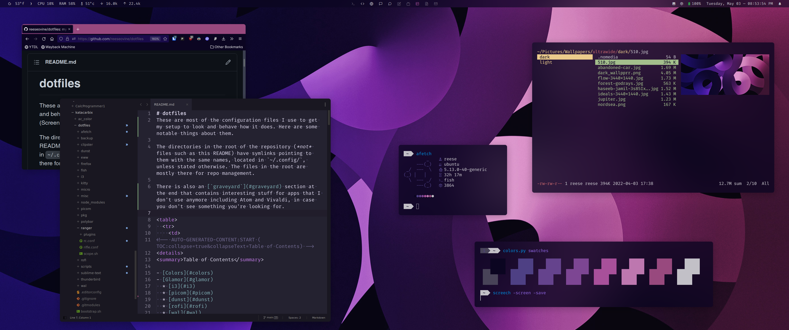

# dotfiles
These are most of the configuration files I use to get my setup to look and behave how it does. Here are some notable things about them.

The directories in the root of the repository (*not* files such as this README) have symlinks pointing to them with the same names, located in `~/.config/`, unless stated otherwise. The files in the root are mostly there for repo management.

There is also a [`graveyard`](#graveyard) section at the end that contains interesting stuff for apps that I don't use anymore including Atom and Vivaldi, in case you don't see something you're looking for.

<table>
  <tr>
    <td>
<!-- AUTO-GENERATED-CONTENT:START (TOC:collapse=true&collapseText=Table of Contents) -->

Table of Contents

- [Colors](#colors)
- [Glamor](#glamor)
  * [i3](#i3)
  * [picom](#picom)
  * [dunst](#dunst)
  * [rofi](#rofi)
  * [wal](#wal)
  * [Firefox](#firefox)
  * [Sublime Text](#sublime-text)
  * [Discord](#discord)
  * [Fonts](#fonts)
- [Terminal environment](#terminal-environment)
  * [kitty](#kitty)
  * [fish](#fish)
  * [ranger](#ranger)
- [Scripts](#scripts)
- [Programs you should know about that weren't mentioned elsewhere](#programs-you-should-know-about-that-werent-mentioned-elsewhere)
- [Miscellanea](#miscellanea)
- [Graveyard](#graveyard)
  * [Abricotine](#abricotine)
  * [Atom](#atom)
  * [polybar](#polybar)
  * [Vivaldi](#vivaldi)
  * [zsh](#zsh)

<!-- AUTO-GENERATED-CONTENT:END -->
    </td>
  </tr>
</table>

## Colors
[pywal](https://github.com/dylanaraps/pywal) is a tool that picks a wallpaper and generates a color palette from the dominant colors in it. The colors are used in various parts of my desktop, including:

- i3 (and i3-lock)
- polybar
- rofi
- kitty (and other terminal emulators)
- Sublime Text
- Firefox
- Discord
- the RGB keyboard in my laptop  
  (still trying to make it work on my not-programmable-over-USB keyboard...)

Some of these refresh their colors automatically but most need to be told to refresh either by [a script](scripts/pywal) or by [a parent program](https://github.com/reeseovine/dotfiles/blob/bb6a9675db69ca6dacb3486502b54762e22f9585/i3/config#L278).

## Glamor
### [i3](i3/config)
[i3-gaps](https://github.com/Airblader/i3) is a fork of the tiling window manager that adds the ability to create gaps between windows in tiling mode so your wallpaper can peek through. In addition to window styling, my config adds quite a few keyboard shortcuts for things like starting apps quickly, opening rofi menus, and taking screenshots.

### [picom](picom/picom.conf)
A small but powerful compositor for X desktops. I'm using [this fork](https://github.com/s0nny7/picom) that fixes one tiny issue with rounded corners in [ibhagwan's picom](https://github.com/ibhagwan/picom).

Compton has the ability to make windows semi-transparent but I chose to forgo this feature in favor of creating transparent areas within some apps. I then turned off blurring in compton's config for any program that's opaque, because there's no reason to do work for something that I'm not even going to see.

### [dunst](dunst/dunstrc)
A notification daemon that displays desktop notifications. Its appearance is pretty extensively customizable, but sadly one thing it can't do is background transparency so it has to be applied to the entire notification. Luckily it's not too noticeable (in my opinion). It doesn't use colors from wal because I think it looks better without them.

### [rofi](rofi/config.rasi)
Mostly just preferences for behavior rather than appearance, which is taken care of in [this wal template](wal/templates/colors-rofi-dark.rasi). When I have time I want to go through and update the theme to account for some things I didn't know about when I first made it (like the `-mesg` line).

### [wal](wal)
Contains templates for programs to import the colors and handmade color schemes for some wallpapers.

### [Firefox](firefox)
I'm using the [Pywalfox](https://github.com/Frewacom/pywalfox) extension + a few UI tweaks in my `userChrome.css` and `userContent.css`. I'm also using everything in my [`userstyles` repo](https://github.com/reeseovine/userstyles) with the [Stylus](https://github.com/openstyles/stylus) extension.

### [Sublime Text](sublime-text)
*Symlinked as \~/.config/sublime-text-3/Packages/User*
I have yet to create a UI theme that matches the rest of my desktop, so for now I'm using the [gruvbox](https://packagecontrol.io/packages/gruvbox) theme. It works with any color scheme, not just gruvbox.

### Discord
<small><em><strong>NOTE:</strong> Modifying the Discord client's code goes against Discord's Terms of Service! By doing this your account is subject to suspension. Though I have not heard of this happening, if it happens to you don't say I didn't warn you.</em>  
Okay where were we...</small>

First I installed [EnhancedDiscord](https://github.com/joe27g/EnhancedDiscord) for its CSS loading and other neat plugins. To enable transparency follow these steps:

1. Make sure you have `npm`, then install `asar` with `sudo npm i -g asar`.
2. Exit Discord completely.
3. cd into `~/.config/discord/0.0.XX/modules/discord_desktop_core/` (where "XX" is the current version number), then unpack the core program with `asar extract core.asar core.asar.extracted`.
4. Open the file `core.asar.extracted/app/mainScreen.js` in your text editor of choice.
5. Around line `372` inside the `mainWindowOptions` object and outside of the `webPreferences` object, set `backgroundColor: '#00000000'` and `frame: false`, and add the line `transparent: true`. Make sure there's a comma after each of these.
6. Save this file, then package it back up with `asar pack core.asar.extracted core.asar`.
7. Open Discord, go to Settings, scroll down to Advanced, and disable Hardware Acceleration.

I modified the application entry to use the command line argument `--remote-debugging-port=1666` which allows [the `lightswitch` script](scripts/lightswitch) to switch between light and dark mode.
I'm using the pywal variant of my [Bliss theme](https://github.com/reeseovine/discord-stuff/) which gets recompiled by the pywal script.

### Fonts
The sans-serif font I use is [Roboto](https://github.com/googlefonts/roboto). I use a [Nerd Font](https://github.com/ryanoasis/nerd-fonts)-patched version of [Fira Code](https://github.com/tonsky/FiraCode), a monospaced programming font, in my terminal and code editor. I have an older version of it installed as well because [the newer version doesn't look right in polybar](https://github.com/polybar/polybar/issues/991).

## Terminal environment
### [kitty](kitty/kitty.conf)
I like [kitty](https://sw.kovidgoyal.net/kitty/) because it's fast and has many settings to get it to look and work how I want it to. A good terminal emulator makes working inside of it much more enjoyable. Pywal can set the colors of most terms automatically, and kitty is one of them.

My config contains only the features that I need. I try not to get bogged down by learning every single thing that it can do and just rely on i3 for most of that.

### [fish](fish)
fish is nice because it leaves behind some of the typical shell paradigms carried through the decades in favor of having a much more friendly user experience.

I was hesitant to try it at first because people say it's "not POSIX-compliant". But what does that mean, really? The scripts that I had written already have a [hashbang](https://en.wikipedia.org/wiki/Shebang_(Unix)) line at the top, which should always be standard practice anyway. Another supposed drawback is that most shell-code pasted into the terminal won't always work right away, but I found this to be the case with zsh sometimes too.

Overall I think fish is easier to use, and if backwards-compatibility is needed it's easy to just switch to another shell temporarily.

I'm using [oh my fish](https://github.com/oh-my-fish/oh-my-fish) with the `bobthefish` theme.

### [ranger](ranger)
A TUI file manager. It's highly customizable but I found that there isn't much that I really needed to change to make it work well. There's a bit of a learning curve to it but there are plenty of helpful resources you can find.

## Scripts
*The shell scripts which were previously found here are now located in [this repo](https://github.com/reeseovine/shell-scripts)!*

## Programs you should know about that weren't mentioned elsewhere
*Located in \~/.local/bin/ or installed using a package manager*

[**Bitwarden**](https://bitwarden.com/), [**rbw**](https://github.com/doy/rbw), and [**rofi-rbw**](https://github.com/fdw/rofi-rbw)  
Open-source password manager with apps and extensions for many platforms.

[**clipster**](https://github.com/mrichar1/clipster) and [**rofi-clipster**](https://github.com/fdw/rofi-clipster)  
Simple and performance-friendly clipboard history manager.

[**h**](https://github.com/zimbatm/h)  
Clones git repos and organizes them by their URL (like `go get`) and `cd`s into them.

[**kb-backlight**](https://github.com/hastinbe/i3-kb-backlight)  
Controls keyboard backlight brightness.

[**maim**](https://github.com/naelstrof/maim)  
Takes screenshots.

[**ripgrep (`rg`)**](https://github.com/BurntSushi/ripgrep)  
Searches for patterns within files in a directory. Super fast.

[**zoxide**](https://github.com/ajeetdsouza/zoxide)  
Quickly navigates your filesystem by keeping a record of your most-visited directories.

## Miscellanea
*Stored in [`misc/`](misc)*

- [`.bash_aliases`](misc/.bash_aliases) *Symlinked in \~* - Command aliases sourced by bash and fish.
- [`.profile`](misc/.profile) *Symlinked in \~* - Script that runs when a shell is opened.
- [`.xinitrc`](misc/.xinitrc) *Symlinked in \~* - Script that runs when X session starts.
- [`libinput-gestures.conf`](misc/libinput-gestures.conf) *Symlinked in ~/.config/* - Touchpad gestures for libinput.
- [`lightdm-mini-greeter.conf`](misc/libinput-gestures.conf) *Symlinked in /etc/lightdm/* - Config file for [lightdm-mini-greeter](https://github.com/prikhi/lightdm-mini-greeter).
- [`logid.cfg`](misc/logid.cfg) *Symlinked in /etc/* - Gesture and button mapping for Logitech mice using [logiops](https://github.com/PixlOne/logiops).
- [`.nanorc`](misc/.nanorc) *Symlinked in ~* - Config for the `nano` text editor. I don't use it often but it's nice to keep this on hand.
- [`rofimoji.rc`](misc/rofimoji.rc) *Symlinked in \~/.config/* - Config for [rofimoji](https://github.com/fdw/rofimoji), a Unicode character picker.

## Graveyard

These used to be part of my setup but have since been replaced or superseded. Links go to the file or directory at the last commit it existed in.

### [Abricotine](https://github.com/reeseovine/dotfiles/tree/478ccfac46873f887dd86cc26ef51896212deca7/abricotine)
*Symlinked as ~/.config/Abricotine/app*

Markdown editor with custom theme support. No transparency out of the box but could probably be modified in the same way as Atom, though I like it better opaque. My wal theme is based on the default dark theme. I haven't figured out how to make it refresh the theme automatically yet so it must be done manually (ctrl+F5).

### [Atom](https://github.com/reeseovine/dotfiles/tree/5d37fdf7cae8477866f3e4d911f401a1a0c75185/atom)
*Symlinked as ~/.atom*

Because it does not support transparent themes out of the box (on Linux, at least), I needed to make a quick modification to its internals. Don't worry, it doesn't involve building anything from source. Here are the steps I followed:
0. Make sure you have `npm`, then install `asar` with `sudo npm i -g asar`.
1. Exit Atom completely.
2. cd into `/usr/share/atom/resources/`, then unpack the main program with `sudo asar extract app.asar app.asar.extracted`. You must use `sudo` because it's in a write-protected directory.
3. Open the file `app.asar.extracted/src/main-process/atom-window.js` in your text editor of choice (with root privileges).
4. Around line 38 inside the `options` object and outside of the `webPreferences` object, add the line `transparent: true,` which will make the window background transparent. (I've also added `frame: false,` to mine which will hide the window title and menu bars. You don't have to.)
5. Save this file, then package it back up in the terminal with `sudo asar pack app.asar.extracted app.asar`. If you did it correctly you should be able to start Atom again! You won't see a difference at first because...
6. You need a theme that supports transparency! I'm using my [Fang](https://github.com/reeseovine/fang-ui) and [Wave](https://github.com/reeseovine/wave-ui) UI themes (dark and light mode, respectively). [native-ui](https://atom.io/themes/native-ui) works rather well too.

I wrote some styles to go along with Fang/Wave in [my stylesheet](https://github.com/reeseovine/dotfiles/tree/5d37fdf7cae8477866f3e4d911f401a1a0c75185/atom/styles.less) that adds colors from pywal.

### [polybar](https://github.com/reeseovine/dotfiles/tree/7d0cb94190865be18b33439af6032cbc68fbfedd/polybar)
A status bar with easy access to scripts and whatever else I need. There's the `main` bar, and one called `secondary` which is stripped down for multi-monitor setups. The [`rebar`](https://github.com/reeseovine/shell-scripts/blob/e3c7d5f07ffd501b990d9756f6776f3c08404e94/rebar) script detects monitors and places these bars automatically.

### Vivaldi
Vivaldi can use [custom CSS](https://github.com/reeseovine/dotfiles/blob/478ccfac46873f887dd86cc26ef51896212deca7/vivaldi/common.css) with an [experimental toggle](https://forum.vivaldi.net/topic/37802/css-modifications-experimental-feature) which is nice, but it doesn't go so far as to be pywal-friendly without having to restart every time. Fortunately I can use [this script](https://github.com/reeseovine/dotfiles/blob/478ccfac46873f887dd86cc26ef51896212deca7/scripts/vivwal) (by [wismut on vivaldi.net](https://forum.vivaldi.net/topic/34521/linux-changing-theme-via-command-line/22?_=1597433612704) and slightly modified by me) to set the theme colors through a remote Chromium console. It's pretty clever honestly. Vivaldi must be started with the command `vivaldi --remote-debugging-port=9222` for this to work.

### [zsh](https://github.com/reeseovine/dotfiles/blob/a9a48029a841bcfb61112c4153b24b875f49f6cb/.zshrc)
Nothing special. Uses oh my zsh.
